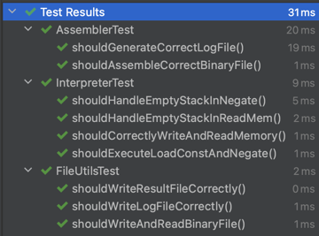

# Kotlin Assembly and Virtual Machine

## Table of Contents
- [Overview](#overview)
- [Features](#features)
- [Installation](#installation)
- [Usage](#usage)
- [Commands](#commands)
- [Examples](#examples)
- [Testing](#testing)

## Overview
The project simulates a basic stack-based virtual machine with a custom instruction set. An **assembler** reads an assembly-like source file and generates a binary file along with logs in CSV format. The **interpreter** reads the binary file, executes the instructions, and outputs the state of the memory to a result CSV file.

## Features
- **Assembler**: Converts assembly-like source code into binary and generates a log file in CSV format.
- **Interpreter**: Executes binary instructions, manipulating a stack and memory.
- **Memory Logging**: Outputs memory state within a specified range to a CSV file.
- **Unit Tests**: Comprehensive tests for all components using JUnit.

## Installation

1. **Clone the repository**:
   ```bash
   git clone https://github.com/usainbald/kotlin-assembly.git
   cd kotlin-assembly
   ```

2. **Build the project** using Gradle:
   ```bash
   ./gradlew build
   ```

3. **Run the tests** to ensure everything is set up correctly:
   ```bash
   ./gradlew test
   ```

## Usage

### Running the Assembler and Interpreter
The application expects five arguments:
1. The path to the **source file** (`.txt`) containing assembly code.
2. The path to the **binary file** (`.bin`) where the assembled binary code will be stored.
3. The path to the **log file** (`.csv`) where the assembled commands and values will be logged.
4. The path to the **result file** (`.csv`) where the final memory state will be output.
5. The **memory range** as a string (`start:end`) to specify the range of memory addresses to output.

Example command to run the application:
```bash
./gradlew run --args="source.txt binary.bin log.csv result.csv 0:10"
```

### Assembling and Interpreting Manually
Alternatively, you can build the JAR file and run it:
```bash
./gradlew jar
java -jar build/libs/kotlin-assembly-vm.jar source.txt binary.bin log.csv result.csv 0:10
```

## Commands

The assembly language supports the following commands:

| Command       | Description                                               | Example                |
|---------------|-----------------------------------------------------------|------------------------|
| `load_const`  | Loads a constant value onto the stack.                    | `load_const 5`         |
| `read_mem`    | Reads a value from memory at an address from the stack.   | `read_mem`             |
| `write_mem`   | Writes a value from the stack to a memory address.        | `write_mem`            |
| `negate`      | Negates the top value on the stack.                       | `negate`               |

## Examples

### Example Source File
Here’s an example source file (`source.txt`):

```
load_const 5
load_const 10
negate
write_mem
load_const 1
read_mem
negate
write_mem
```

### Expected Output

1. **Binary File (`binary.bin`)**: The assembler converts the instructions into binary format.
2. **Log File (`log.csv`)**: Records the commands and values:
   ```
   command,value
   load_const,5
   load_const,10
   negate,
   write_mem,
   load_const,1
   read_mem,
   negate,
   write_mem,
   ```
3. **Result File (`result.csv`)**: Outputs the state of memory after execution (based on the specified range `0:10`):
   ```
   address,value
   0,0
   1,0
   2,0
   3,0
   4,0
   5,-10
   6,0
   7,0
   8,0
   9,0
   10,0
   ```

## Testing
The project includes unit tests for the assembler, interpreter, and utility methods. The tests are located in the `src/test/kotlin` directory. To run the tests:

```bash
./gradlew test
```

The tests cover:
- Correct binary file generation by the assembler.
- Proper logging in the log file.
- Memory manipulation and stack operations in the interpreter.
- Utility methods for writing binary and CSV files.

### Test Results

Below is an image showcasing the test results:

